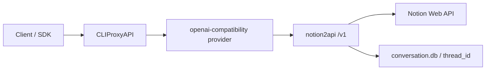

# Notion2API 集成指南

更新：CLIProxyAPI 现在已经支持原生 `notion-api-key` provider。本文保留 sidecar 方案，适合你继续把外部 `notion2api` 当作 OpenAI 兼容服务接入；如果你想把凭证和执行链直接收口到 CLIProxyAPI，本仓库现在优先建议改用原生 `notion` provider。

当前面板入口分成两条：

- `AI Providers -> Notion`：维护 `notion-api-key` 配置项
- `Auth Files -> 新增 Notion 凭证`：维护 `auths/*.json` 形式的 Notion 凭证文件

本文档说明如何把 [notion2api](https://github.com/freedomxia/notion2api) 作为 sidecar 接入 CLIProxyAPI，而不是立即为 Notion 单独实现一个原生 provider。

## 推荐方案

优先使用 `openai-compatibility`：

- `notion2api` 自身已经暴露标准 `/v1/chat/completions` 和 `/v1/models`
- CLIProxyAPI 已内置 OpenAI 兼容 provider 入口，不需要新增执行器
- OpenAI -> OpenAI 翻译链路只重写 `model`，不会主动剥离 `conversation_id`
- 非流式响应和流式事件默认透传，适合先验证 `search_metadata`、`reasoning_content` 等 notion2api 扩展

只有在下面情况出现时，才建议升级为原生 provider：

- 需要把 Notion 凭证直接纳入 CLIProxyAPI 的认证管理和热更新
- 需要在 CLIProxyAPI 管理面板里直接创建、轮换、禁用 Notion 账号
- 需要对 Notion 专有流事件做二次翻译，而不是简单透传

## notion2api 凭证要求

`notion2api` 侧最少需要这些字段：

- `token_v2`
- `space_id`
- `user_id`

对应实现见 notion2api 的 `app/config.py`。

如果启用 Heavy 模式，还会额外依赖 `SILICONFLOW_API_KEY` 做会话压缩；会话和 `thread_id` 由 `notion2api` 自己的 SQLite 管理，见 notion2api 的 `app/conversation.py`。

## 接入拓扑



## CLIProxyAPI 配置示例

把下面的配置合入你的 `config.yaml`：

```yaml
openai-compatibility:
  - name: "notion2api"
    prefix: "notion"
    base-url: "http://127.0.0.1:8000/v1"
    api-key-entries:
      - api-key: "replace-with-your-notion2api-api-key"
    models:
      - name: "claude-sonnet4.6"
        alias: "notion/claude-sonnet4.6"
      - name: "claude-opus4.6"
        alias: "notion/claude-opus4.6"
      - name: "gpt-5.4"
        alias: "notion/gpt-5.4"
      - name: "gemini-3.1pro"
        alias: "notion/gemini-3.1pro"
```

对应配置入口见 `config.example.yaml` 里的 `openai-compatibility` 示例。

如果你想直接本地联调，不想自己再拼容器编排，可以直接看：

- `examples/notion2api-sidecar/README_CN.md`
- `examples/notion2api-sidecar/docker-compose.yml`

## 最小落地步骤

1. 启动 notion2api

```bash
cd /path/to/notion2api
cp .env.example .env
docker-compose up -d
```

或本地运行：

```bash
cd /path/to/notion2api
pip install -r requirements.txt
uvicorn app.server:app --host 0.0.0.0 --port 8000
```

2. 在 CLIProxyAPI 配置里加入上面的 `openai-compatibility` provider。

3. 重启 CLIProxyAPI，然后先测模型列表：

```bash
curl -s http://127.0.0.1:8317/v1/models \
  -H 'Authorization: Bearer your-cli-proxy-key'
```

4. 再测会话透传：

```bash
curl http://127.0.0.1:8317/v1/chat/completions \
  -H 'Content-Type: application/json' \
  -H 'Authorization: Bearer your-cli-proxy-key' \
  -d '{
    "model": "notion/claude-sonnet4.6",
    "stream": false,
    "conversation_id": "demo-conv-1",
    "messages": [
      {"role": "user", "content": "用一句话介绍你自己"}
    ]
  }'
```

如果返回正常，并且再次请求同一个 `conversation_id` 能延续上下文，说明 sidecar 方案已经成立。

## 为什么这个方案可行

关键证据在 CLIProxyAPI 现有实现：

- `internal/translator/openai/openai/chat-completions/openai_openai_request.go` 只改 `model`
- `internal/translator/openai/openai/chat-completions/openai_openai_response.go` 对流式事件做近似透传
- `internal/translator/openai/openai/chat-completions/openai_openai_response.go` 对非流式响应直接返回原文
- `internal/runtime/executor/openai_compat_executor.go` 负责把请求发到外部 OpenAI 兼容服务

`notion2api` 对应依赖点：

- notion2api 的 `app/schemas.py` 定义了扩展字段 `conversation_id`
- notion2api 的 `app/api/chat.py` 会用这个字段恢复或创建会话
- notion2api 的 `app/api/chat.py` 会输出 `search_metadata` 自定义流事件
- notion2api 的 `app/notion_client.py` 使用 Notion Web API

## 已知边界

- `search_metadata` 不是标准 OpenAI SSE 事件，只有愿意读取原始流事件的客户端才能消费它
- Heavy 模式的长会话记忆和 `thread_id` 存储仍然发生在 `notion2api` 本身，不在 CLIProxyAPI 内部
- notion2api 的多账号轮询和冷却逻辑也保留在其自身实现里，不需要复制到 CLIProxyAPI

## 下一阶段

如果 sidecar 方案跑通，建议下一步再做二选一：

1. 保持 sidecar 架构，只补管理文档、容器编排和端到端测试
2. 为 CLIProxyAPI 增加原生 `notion` provider，把凭证、模型注册、线程生命周期都收口到一个服务里
